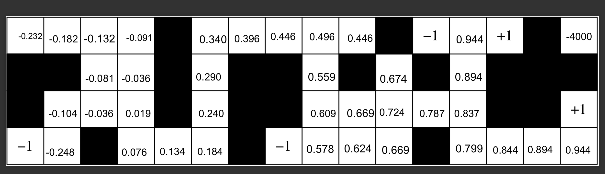
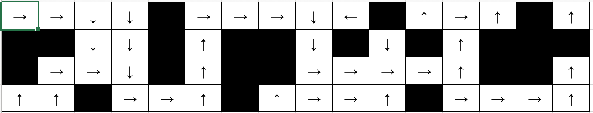

```{r setup, include=FALSE}
knitr::opts_chunk$set(echo = TRUE)
```

### Analysis 
####Problem 5: Value Iteration 

##### Test

We ran value iteration on the 4x3.mdp grid world with gamma as 0.99999 and $\epsilon$ as 0.0001. We got the exact same utilities as given in the book (Figure 17.3, p. 651).


##### Predict

From the starting point, the closest terminal state with a utility of +1 is 23 steps away. Given that each step has an immediate reward of -0.04, the cumulative reward up until reaching the said terminal state would be -0.92. The compensation of +1 utility at the terminal state after incurring a reward of -0.94 is not enough to make the utility of the starting state to be positive. Thus, we predict that the utility of the start state will be negative. We contrast this prediction with the utility of the start state (0.812) for the 4 $\times$ 3.mdp grid world. In fact, none of the states in the 4 $\times$ 3.mdp grid world has a negative utility as the size of the world is too small to incur significant negative rewards. 

Our hypothesis is that the utility of a state is inversely proportional to the length of the shortest path from the given state to the closest terminal state of utility +1. Besides that, we posit that the terminal state with utility -1 will reduce the utility of its neighboring states. As we move towards a path that leads to a terminal state with utility of +1, we expect the utilities of the states to increase. 

We noticed that there is an unreachable state in the top right corner of the 16 $\times$ 4.mdp grid world. If an agent finds itself in this state, then it is trapped. Any action taken by the agent will not change the state of the agent but will still incur a reward of that state (-0.04). Since the reward of this state is negative, we expect the utility of this state to be $-\infty$.

##### Experiment 

We used our own version of value_iteration to produce this data. 




##### Reflect
We correctly predicted that the start state will have a negative utility. As we expected, the utility of a state is inversely proportional to the length of the shortest path from the given state to the closest terminal state of utility +1. The utility of the unreachable state in the top right corner was -4000. We were partially correct as we predicted the utility of this state to be  $-\infty$. In the context, -4000 is an abnormally low value and is consistent with our reasoning on why the utility of the state should be  $-\infty$. However, we are unsure as to why it stopped at -4000. 

We incorrectly predicted that terminal state with utility -1 would severely influence the utilities of the neighboring states. The influence was not as strong as we expected. After looking at the utilities, we realized that the terminal states with utilities +1 and -1 are placed in such a way that they are never orthogonal to each other. In other words, any attempt by the agent to go to a terminal state with utility +1 will never send the agent to a terminal state with utility -1. 


####Problem 5: Policy Iteration

##### Test
We ran policy iteration on the 4 $\times$ 3.mdp grid world with gamma as 0.99999 and $\epsilon$ as 0.0001. We got the exact same policy as given in the book (Figure 21.1, p. 832).

##### Predict
Our hypothesis for the previous prediction was that the "utility of a state is inversely proportional to the length of the shortest path from the given state to the closest terminal state of utility +1." In the same vein, we expect that for each state the best action will be towards the path that leads to the closest terminal state of utility +1. 

##### Experiment 
We used our version of value_iteration to produce this data. 




#####Reflect
The policy is consistent with our prediction. For each state, except of the terminal states and the unreachable state at the top right, the policy advises the agent to follow action that leads to the shortest path to the closest terminal state of utility +1. 


