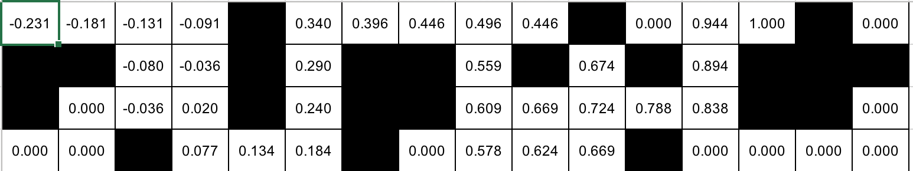
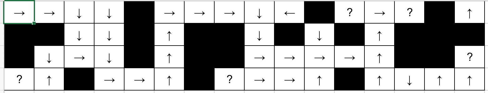

```{r setup, include=FALSE}
knitr::opts_chunk$set(echo = TRUE)
```

### Analysis 

#### Part A: Temporal Difference Learning
##### Test
[We used our own implementation of TD learning]

It takes around 10000000 trails before the utilities exactly match nearly all those of Figure 21.1(b). We set the value of gamma at 0.999999 for this test. 


##### Predict
We predict that the TD-learner on the larger 16x4 world, will take 5 times as much time than the 4x3 world. Ignoring that some states are unreachable, we observe that the 4x3 world has 12 states and the the 16x4 world 64 states. Since there are approximately 5 times the number of states in the  16x4 world, we posit that it will take 5 times more number of trials. 


##### Experiment



Surprisingly, even after only 1000000 trials, we get values that exactly match those given by value iteration. 


##### Reflect 

We expected that the 16x4 world would need 5 times the number of trials as the 4x3 world. However, this prediction was false, the utility values converged in much fewer number of trials.

Figure 21.5 (a) explains why the values may have converged in a fewer number of trials. Notice that the accuracy of utility estimates and the number of trials has a logarithmic relation. This means that after a certain point, even a massive increase in the number of trials will only have a slight effect in the utility estimates. Our prediction of the required number of trials was very far from the inflection point, and did not really change the utility estimates after a certain point. 

It is also possible that the the most of the states in the 16x4 world are never explored as per the policy. This means that our heuristic of the 16x4 world having 5 times the number of states is not very useful. 


#### Part A: Q-Learning 
##### Test 

[We used Jerrod Welshman's code for qlearn]

We fixed the number of trials at 1000000. We felt that it was safer to have more trials than fewer trials as it having more trials in a converging function will not make our estimates worse. 

After multiple tests with different rewards and attempts parameters, we found the  policy closest to optimal when we had rewards set to 0.8 and attempts set to 50. 


##### Predict
We think that the number of trials can be the same as our choice of number of trials is fairly high.
Since the reward should be independent of the total number of states in the task environment, we felt that the using the same reward would be consistent. However, since 16x4 world has more states, it would be wiser to attempt an action state pair multiple times. This is because the value of utilities will propagate over the state's neighbors, and in a larger world, more time is needed for the information to propagate. Thus, we think that the 16x4 world will need 5 times more attempts than the 4x3 world. 

##### Experiment



The parameters we used gave us the policy closest to optimal. The policy is consistent without hypothesis that "for each state, the best policy is to follow the shortest path to a terminal state of utility +1." Even though the policy is not exactly the same as the policy that we learned from the last lab using policy iteration, it does a good job and has a clear logic to why it wants the agent to pick a particular action at a particular state. 


##### Reflect 

We are very happy with our prediction. Our main idea was to use the same value for rewards as reward should not depend on the total number of states. We used more attempts for the 16x4 world because having more states means that it takes more time for information to propagate. Thus, the agent must have more tries for each <action,state> pair. 


